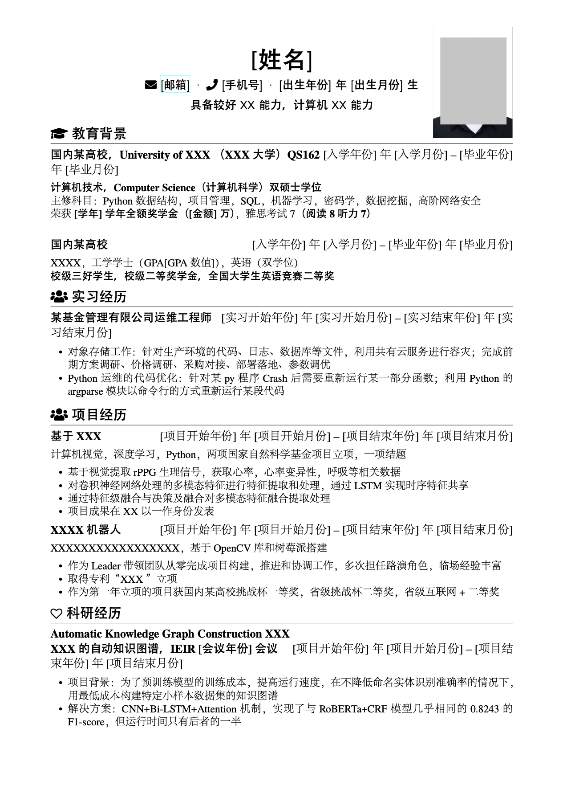

# Résumé

一个优雅的 LaTeX 简历模板，支持中英文双语，适合一页纸展示，使用 XeLaTeX 编译。该模板旨在提供更好的中文支持和可定制性，灵感来源于以下项目：



- [zachscrivena/simple-resume-cv](https://github.com/zachscrivena/simple-resume-cv)
- [res](https://www.ctan.org/pkg/res)
- [JianXu's CV](http://www.jianxu.net/en/files/JianXu_CV.pdf)
- [paciorek's CV/Resume template](http://www.stat.berkeley.edu/~paciorek/computingTips/Latex_template_creating_CV_.html)
- [How to write a LaTeX class file and design your own CV (Part 1) - ShareLaTeX](https://www.sharelatex.com/blog/2011/03/27/how-to-write-a-latex-class-file-and-design-your-own-cv.html)

## 特性

- **中英文双语支持**：提供 `resume-cn.tex` 和 `resume-en.tex` 两个版本，满足不同语言需求。
- **完善的中文支持**：使用 Adobe 字体，确保中文排版美观。
- **可定制的证件照排版**：支持添加个人照片，位置和样式可自定义，不影响文字排版。
- **FontAwesome 图标支持**：集成 FontAwesome 4.3.0，增强视觉效果。
- **简洁的宏定义**：通过自定义宏简化简历内容的编写和维护。
- **易于扩展和维护**：结构清晰，便于根据个人需求进行修改。

## 使用方法

### 本地编译

#### 依赖项

- **编译引擎**：XeLaTeX
- **字体**：Adobe 字体（需自行安装）
- **宏包**：
  - `fontawesome.sty`
  - `zh_CN-Adobefonts_external.sty`
  - `linespacing_fix.sty`
  - `resume.cls`

#### 编译步骤

```bash
xelatex resume-cn.tex
# 或者编译英文简历
xelatex resume-en.tex
```

### 在线编译（Overleaf）

1. 打开 [Overleaf](https://www.overleaf.com/)。
2. 点击“New Project” -> “Upload Project”。
3. 上传整个项目文件夹（包含 `.tex`、`.cls`、`.sty` 文件和 `img/` 文件夹）。
4. 在 Overleaf 中设置编译方式为 **XeLaTeX**。
5. 编译 `resume-cn.tex` 或 `resume-en.tex` 文件即可预览/导出 PDF。

## 宏命令说明

- `\name{姓名}`：设置姓名。
- `\contactInfo{邮箱}{手机号}{个人主页}`：设置联系信息。
- `\basicContactInfo{邮箱}{手机号}`：简要联系信息（无个人主页）。
- `\section{标题}`：章节标题，如“教育背景”、“项目经历”等。
- `\subsection{小节标题}`：小节标题。
- `\datedsubsection{小节标题}{时间}`：带时间区间的小节标题，时间右对齐。
- `\itemize`：无序列表。
- `\enumerate`：有序列表。

## FontAwesome 图标使用

1. 访问 [Font Awesome Icons](http://fortawesome.github.io/Font-Awesome/icons/) 选择图标。
2. 在 `fontawesome.sty` 中找到图标对应的命令。
3. 在 `.tex` 中直接使用，例如 `\faEnvelope`。

## 示例

请参考 `resume-cn.tex` 和 `resume-en.tex`，快速开始编辑你自己的简历。

## 许可证

[MIT License](http://opensource.org/licenses/MIT)

> 注意：模板中使用的字体可能受到版权保护，请自行确认使用合法性。
